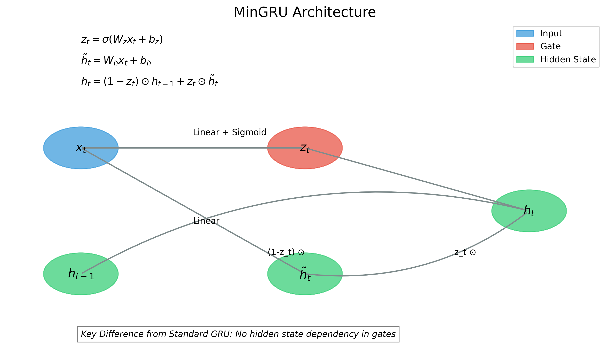

# Minimal RNN Python Implementation with CUDA Optimization

This project provides Python implementations of minimal RNN models (MinGRU and MinLSTM) with highly optimized CPU and GPU (CUDA) versions. The implementation is based on the original C/CUDA project and aims to provide a more accessible interface while maintaining high performance.

## Overview

Minimal RNN models simplify the standard RNN architectures by removing the dependence on the previous hidden state in the gate computations, making them more amenable to parallel processing while maintaining good performance.

### MinGRU

The minimal GRU (MinGRU) simplifies the standard GRU by using the following equations:

- Update Gate: z_t = σ(Linear_z(x_t))
- Candidate State: h_tilde = Linear_h(x_t)
- Hidden State: h_t = (1 - z_t) ⊙ h_{t-1} + z_t ⊙ h_tilde



### MinLSTM

The minimal LSTM (MinLSTM) simplifies the standard LSTM with the following equations:

- Forget Gate: f_t = σ(Linear_f(x_t))
- Input Gate: i_t = σ(Linear_i(x_t))
- Candidate State: h_tilde = Linear_h(x_t)
- Gate Normalization: f'_t = f_t / (f_t + i_t), i'_t = i_t / (f_t + i_t)
- Hidden State: h_t = f'_t ⊙ h_{t-1} + i'_t ⊙ h_tilde


## Features

- Pure Python implementation with NumPy for CPU processing
- Highly optimized CUDA acceleration using Numba for GPU processing
- Adaptive algorithm selection based on sequence length
- Support for both sequential and parallel processing modes
- Benchmarking tools to compare performance across different implementations
- Comprehensive documentation and examples

## Requirements

- Python 3.6+
- NumPy
- Numba (for CUDA acceleration)
- CUDA toolkit (for GPU acceleration)
- Matplotlib (for benchmark visualization)
- Pandas (for data manipulation)
- Tabulate (for pretty-printing benchmark results)

## Installation

1. Clone the repository:
```bash
git clone https://github.com/DaoudiAmir/CUDA_RNN.git
cd CUDA_RNN
```

2. Install the required packages:
```bash
pip install -r requirements.txt
```

## Usage

### Basic Usage

```python
import numpy as np
from min_rnn.min_gru import MinGRUCell
from min_rnn.min_lstm import MinLSTMCell

# Create a MinGRU cell
gru_cell = MinGRUCell(input_size=10, hidden_size=20)

# Process a single input
x_t = np.random.random(10)
h_prev = np.zeros(20)
h_t = gru_cell.forward(x_t, h_prev)

# Process a sequence
x_seq = np.random.random((5, 10))  # 5 time steps, 10 features
h0 = np.zeros(20)
h_out = gru_cell.process_sequence(x_seq, h0)

# Process a sequence in parallel
h_out_parallel = gru_cell.process_sequence_parallel(x_seq, h0)
```

### Using CUDA Acceleration

```python
from min_rnn.min_gru_cuda import MinGRUCellCUDA
from min_rnn.min_lstm_cuda import MinLSTMCellCUDA
from min_rnn.cuda_utils import CUDA_AVAILABLE

if CUDA_AVAILABLE:
    # Create a CUDA-accelerated MinGRU cell
    gru_cell = MinGRUCellCUDA(input_size=10, hidden_size=20)
    
    # Process a sequence with GPU acceleration
    x_seq = np.random.random((5, 10))
    h0 = np.zeros(20)
    h_out = gru_cell.process_sequence(x_seq, h0)
    
    # Process a sequence in parallel with GPU acceleration
    h_out_parallel = gru_cell.process_sequence_parallel(x_seq, h0)
else:
    print("CUDA is not available, falling back to CPU implementation")
```

### Running the Demo

```bash
# Run the demo for both models with CPU
python main.py

# Run the demo for both models with CUDA (if available)
python main.py --cuda

# Run the demo for a specific model
python main.py --model gru
python main.py --model lstm

# Run benchmarks
python benchmark_cuda_optimization.py --model both
```

## Project Structure

- `min_rnn/`: Main package directory
  - `utils.py`: Utility functions (sigmoid, linear layer)
  - `min_gru.py`: CPU implementation of MinGRU
  - `min_lstm.py`: CPU implementation of MinLSTM
  - `min_gru_cuda.py`: CUDA-accelerated implementation of MinGRU
  - `min_lstm_cuda.py`: CUDA-accelerated implementation of MinLSTM
  - `cuda_utils.py`: CUDA kernels and utility functions
- `benchmark_cuda_optimization.py`: Benchmarking script for CUDA optimizations
- `cuda_optimization_results.md`: Detailed documentation of optimization results
- `main.py`: Demo script
- `requirements.txt`: Required packages
- `README.md`: This file

## CUDA Optimization Techniques

The CUDA implementation incorporates several optimization techniques to maximize GPU performance:

### 1. Memory Optimizations
- **Pinned Memory**: Used for faster host-device transfers
- **CUDA Streams**: Implemented asynchronous operations
- **Shared Memory**: Leveraged GPU shared memory to reduce global memory access latency

### 2. Algorithmic Optimizations
- **Adaptive Algorithm Selection**:
  - Direct computation for short sequences (≤16)
  - Fused kernel approach for medium sequences (16-128)
  - Parallel scan for long sequences (>128)
- **Batch Processing**: Implemented kernels that process multiple elements per thread
- **Kernel Fusion**: Combined operations to reduce kernel launch overhead

### 3. GPU Utilization Improvements
- **Optimized Grid/Block Sizes**: Tuned launch configurations for better GPU occupancy
- **Grid Stride Loops**: Implemented to handle multiple elements per thread
- **Coalesced Memory Access**: Improved memory access patterns for better throughput

## Benchmark Results

Our optimized CUDA implementations show significant performance improvements, especially for longer sequences:

### MinGRU Performance Highlights
- **Short sequences (8-64)**: CPU is faster due to transfer overhead
- **Medium sequences (128-256)**: GPU achieves 2.3-4.6x speedup
- **Long sequences (512-1024)**: GPU achieves 4.2-6.3x speedup


### MinLSTM Performance Highlights
- **Short sequences (8-16)**: CPU is faster due to transfer overhead
- **Medium sequences (32-128)**: GPU performance approaches CPU (0.66-1.11x)
- **Long sequences (256-1024)**: GPU achieves impressive 6.2-9.4x speedup


For detailed benchmark results and analysis, see `cuda_optimization_results.md`.

## Performance Considerations

- For optimal performance, use the appropriate implementation based on sequence length:
  - CPU implementation for very short sequences (<32)
  - GPU implementation for longer sequences (>128)
- The parallel scan algorithm provides significant speedup for long sequences
- Memory transfers between CPU and GPU can be a bottleneck for short sequences
- For optimal performance, use float32 data types and avoid unnecessary memory transfers

## License

This project is licensed under the MIT License - see the LICENSE file for details.

## Acknowledgments

This implementation is based on the original paper:

Feng, L., Tung, F., Ahmed, M. O., Bengio, Y., & Hajimirsadeghi, H. (2024). Were RNNs All We Needed? arXiv preprint arXiv:2410.01201. https://arxiv.org/abs/2410.01201

The paper introduces the minimal versions of LSTMs and GRUs (minLSTM and minGRU) that are fully parallelizable during training and achieve competitive performance compared to more complex models.
